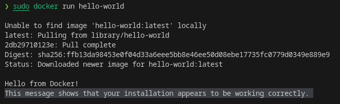
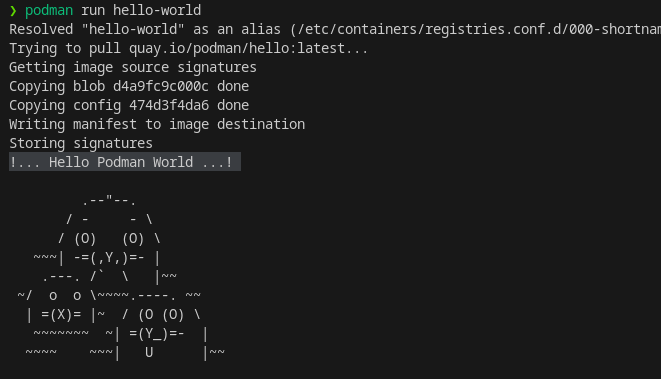

- [java-container-example](#java-container-example)
  * [Windows](#windows)
    + [WSL2 ](#wsl2)
    + [Docker ](#docker)
    + [Podman ](#podman)
  * [Linux](#linux)
    + [Docker ](#docker-1)
    + [Podman ](#podman-1)
  * [Validando a instalação](#validando-a-instalação)
    + [Docker](#docker-2)
    + [Podman](#podman-2)

# java-container-example

## Windows

Requisitos:
  - WSL2
  - Docker ou podman


### WSL2 

  [Instalar o Linux no Windows com o WSL](https://learn.microsoft.com/pt-br/windows/wsl/install)

### Docker 

  [Youtube: Instalar Docker no Windows - Passo a Passo](https://www.youtube.com/watch?v=sYsIoWtS5LY)

### Podman 

  [Instalando o podman (alternativa ao Docker Desktop)](https://educoutinho.com.br/windows/instalando-podman-alternativa-docker-desktop/)


## Linux

Requisitos:
  - Docker ou podman

### Docker 

  - [Install Docker Engine](https://docs.docker.com/desktop/install/linux-install/)

or
  - [Install Docker Desktop on Linux](https://docs.docker.com/desktop/install/linux-install/)
### Podman 

  [Podman Installation Instructions - Installing on Linux ](https://podman.io/getting-started/installation.html#installing-on-linux)


## Validando a instalação

### Docker
```BASH
sudo docker run hello-world
```

Esta mensagem mostra que sua instalação parece estar funcionando corretamente



### Podman
```BASH
podman run hello-world
```


